.. _Discretizers:

Discretizers
============

**AutoCarver** implements **Discretizers**. It provides the following Data Preparation tools: 

+------------------------------------+-------------------------------------------------------------------------+
| Discretizer / Data Type            | Data Preparation                                                        |
+====================================+=========================================================================+
| :ref:`ContinuousDiscretizer`:      | Over-represented values are set as there own modality                   |
|                                    |                                                                         |
| Continuous Data                    | Automatic quantile bucketization of under-represented values            |
|                                    |                                                                         |
| Discrete Data                      | Modalities are ordered by default real number ordering                  |
|                                    |                                                                         |
+------------------------------------+-------------------------------------------------------------------------+
| :ref:`OrdinalDiscretizer`:         | Under-represented modalities are grouped with the closest modality      |
|                                    |                                                                         |
| Ordinal Data                       | Modalities are ordered according to provided modality ranking           |
|                                    |                                                                         |
+------------------------------------+-------------------------------------------------------------------------+
| :ref:`CategoricalDiscretizer`:     | Under-represented modalities are grouped into a default value           |
|                                    |                                                                         |
| Categorical Data                   | Modalities are ordered by target rate                                   |
|                                    |                                                                         |
+------------------------------------+-------------------------------------------------------------------------+

.. note::

   * Representativity threshold of modalities is user selected (:attr:`min_freq`)
   * At this step, if any, ``nan`` are set as there own modality (no given order)
   * Helps improve modality relevancy and reduces the set of possible combinations to test from
   * Included in all carving pipelines: :class:`BinaryCarver`, :class:`MulticlassCarver`, :class:`ContinuousCarver`

.. _ProcessingConfig:

ProcessingConfig
-----------------

Behavioral toggles shared by every discretizer and carver. All flags are optional
and propagate unchanged to sub-discretizers; domain parameters such as ``min_freq``
remain explicit constructor arguments.

.. autoclass:: AutoCarver.discretizers.ProcessingConfig

* ``copy`` (``bool``, default ``True``) — copy input ``X`` rather than mutating it.
* ``ordinal_encoding`` (``bool``, default ``False``) — emit ordinal codes instead of
  string labels (carvers default this to ``True``).
* ``dropna`` (``bool``, default ``False``) — group ``nan`` into another modality
  (carvers default this to ``True``).
* ``verbose`` (``bool``, default ``False``) — print progress and statistics.
* ``n_jobs`` (``int``, default ``1``) — number of workers for parallel fits. Inside
  :class:`BaseCarver`, ``n_jobs > 1`` dispatches one task per feature through
  ``multiprocessing.Pool``; see :ref:`Carvers` for sizing guidance.
* ``min_freq_alpha`` (``float``, default ``0.05``) — two-sided significance level
  of the Wilson score interval used to gate ``min_freq``. A modality is declared
  under-represented only when the Wilson upper bound of its observed proportion is
  *significantly* below ``min_freq`` (see :ref:`MinFreqViability` for the formula
  and decision rule). Smaller :math:`\alpha` → wider CI → fewer rejections → less
  merging; larger :math:`\alpha` → tighter CI → more merging.
  :math:`\alpha = 1` recovers the legacy strict-threshold behaviour.

.. _Discretizer:

Discretizer, a complete discretization pipeline
-----------------------------------------------

.. autoclass:: AutoCarver.discretizers.Discretizer
    :members: fit, transform, fit_transform, to_json, summary

Quantitative Data
-----------------

.. _QuantitativeDiscretizer:

Complete pipeline for continuous and discrete features
^^^^^^^^^^^^^^^^^^^^^^^^^^^^^^^^^^^^^^^^^^^^^^^^^^^^^^

The animation below walks through the five stages of
:class:`QuantitativeDiscretizer` on a synthetic Fare-like distribution with
multiple class-fare spikes (generated with a fixed seed; the discretization
itself is the real output of ``QuantitativeDiscretizer.fit``):

#. **Raw feature** — Gaussian-KDE density estimate; the lognormal body sits
   under several discrete "class fare" peaks (``0``, ``7.25``, ``13``,
   ``26.55``), with the NaN proportion held aside.
#. **Over-represented values detected** — values occurring more often than
   :math:`1/q` get their own singleton bin; here all four class-fare spikes
   qualify (marked in orange).
#. **After ContinuousDiscretizer** — four thin spike singletons plus the
   quantile bins that fill the gaps between them. Bars whose Wilson upper
   bound falls below ``min_freq`` are outlined in orange (the sparse segment
   ``(13, 25.9]`` and the tail ``(26.55, 33.9]``) — these are the bins the
   OrdinalDiscretizer pass will merge.
#. **Merge direction chosen** — :class:`OrdinalDiscretizer` merges each rare
   bin into the dominant neighbour with the closest target rate; dashed arrows
   point from the sparse bin to the bin that absorbs it.
#. **After QuantitativeDiscretizer** — the six surviving bins. Each merged
   bar spans the union of its absorbed Stage-2 slots and keeps the dominant
   (anchor) bin's colour, so the eye can track which bin "swallowed" its
   sparse neighbour.

.. autoclass:: AutoCarver.discretizers.QuantitativeDiscretizer
    :members: fit, transform, fit_transform, to_json, summary

.. _ContinuousDiscretizer:

Continuous Discretizer
^^^^^^^^^^^^^^^^^^^^^^

The animation below walks through the three stages of
:class:`ContinuousDiscretizer` on a synthetic Fare-like distribution
(generated with a fixed seed; the discretization itself is the real output of
``ContinuousDiscretizer.fit_transform``):

#. **Raw feature** — Gaussian-KDE density estimate of the continuous values,
   with the NaN proportion held aside.
#. **Over-represented value detected** — values occurring more often than
   :math:`1/q` get their own modality (here ``Fare = 0``, marked in orange).
#. **After ContinuousDiscretizer** — the over-rep modality plus quantile
   bins; bar widths reflect each modality's real value range and bar heights
   its real frequency, with a horizontal reference at ``min_freq``.

.. autoclass:: AutoCarver.discretizers.ContinuousDiscretizer
    :members: fit, transform, fit_transform, to_json, summary

Qualitative Data
----------------

.. _QualitativeDiscretizer:

Complete pipeline for categorical and ordinal features
^^^^^^^^^^^^^^^^^^^^^^^^^^^^^^^^^^^^^^^^^^^^^^^^^^^^^^

The animation below shows how :class:`QualitativeDiscretizer` processes two
features in parallel — a categorical feature (``Port``, top strip) and an
ordinal feature (``AgeGroup``, bottom strip):

#. **Raw features** — both strips shown: ``Port`` bars in frequency-descending
   order, ``AgeGroup`` bars in declared ordinal order; rare modalities outlined
   orange on each.
#. **Rare modalities grouped** — rare ``Port`` modalities (``Belfast``,
   ``Boston``) collapse into ``__OTHER__``; ``AgeGroup`` is unchanged (dimmed
   at 60 % opacity — not yet processed).
#. **After CategoricalDiscretizer** — ``Port`` bars reordered by ascending
   ``P(y=1)``; dot trace is now monotonic. ``AgeGroup`` still unchanged (dimmed).
#. **OrdinalDiscretizer — merge direction** — ``Port`` at full opacity (done);
   curved arrows show which rare ``AgeGroup`` modality merges into which
   neighbour.
#. **After QualitativeDiscretizer** — both strips at full opacity; ``AgeGroup``
   bars span the slots of their absorbed modalities, ordinal order preserved.

.. autoclass:: AutoCarver.discretizers.QualitativeDiscretizer
    :members: fit, transform, fit_transform, to_json, summary

.. _CategoricalDiscretizer:

Categorical Discretizer
^^^^^^^^^^^^^^^^^^^^^^^

The animation below walks through the three stages of
:class:`CategoricalDiscretizer` on a synthetic Titanic-flavored ``Port``
feature (generated with a fixed seed; the discretization itself is the real
output of ``CategoricalDiscretizer.fit_transform``):

#. **Raw feature** — bars in frequency-descending order, with a small
   target-rate (:math:`P(y=1)`) dot above each bar. Bars whose Wilson upper
   bound falls below ``min_freq`` are outlined in orange (here ``Belfast``
   and ``Boston``).
#. **Rare modalities grouped** — under-represented modalities collapse into
   the default ``__OTHER__`` bin; the dot above ``__OTHER__`` is the
   frequency-weighted target rate of the absorbed modalities.
#. **After CategoricalDiscretizer** — bars reordered by ascending target
   rate. The dot trace is now monotonic; each modality keeps its colour
   across the reorder so the eye can track its movement.

.. autoclass:: AutoCarver.discretizers.CategoricalDiscretizer
    :members: fit, transform, fit_transform, to_json, summary

.. _OrdinalDiscretizer:

Ordinal Discretizer
^^^^^^^^^^^^^^^^^^^

The animation below walks through the three stages of
:class:`OrdinalDiscretizer` on a synthetic Titanic-flavored ``AgeGroup``
ordinal feature (generated with a fixed seed; the discretization itself is
the real output of ``OrdinalDiscretizer.fit_transform``):

#. **Raw feature** — bars in the user-declared ordinal order (``child`` →
   ``elderly``), with a small target-rate (:math:`P(y=1)`) dot above each
   bar. Bars whose Wilson upper bound falls below ``min_freq`` are outlined
   in orange (here ``teen`` and ``elderly``). The dot trace is *not*
   monotonic — ordinals are ranked by domain meaning, not by target rate.
#. **Merge direction chosen** — each rare modality merges with the
   adjacent neighbour whose target rate is closest (or its only neighbour
   at the edges). Dashed arrows show the chosen direction.
#. **After OrdinalDiscretizer** — merged bars span the slots of their
   absorbed modalities, ordinal order preserved.

.. autoclass:: AutoCarver.discretizers.OrdinalDiscretizer
    :members: fit, transform, fit_transform, to_json, summary

.. _NestedDiscretizer:

Nested Discretizer
^^^^^^^^^^^^^^^^^^

:class:`NestedDiscretizer` collapses several nested columns of increasing granularity
(``col_a`` ⊃ ``col_b`` ⊃ ``col_c``) into a single robust output column. For each
:class:`NestedFeature`, modalities of the finest column that are too rare are rolled up to the
coarser modality they are nested within — derived from the data — level by level until every
surviving modality is frequent enough. It integrates into the carving pipeline automatically:
declare nested features via ``Features(nested={"col_c": ["col_b", "col_a"]})``.

.. autoclass:: AutoCarver.discretizers.NestedDiscretizer
    :members: fit, transform, fit_transform, to_json, summary

.. _StringDiscretizer:

String Discretizer
^^^^^^^^^^^^^^^^^^

:class:`StringDiscretizer` is used as a data preparation tool to convert qualitative data to :class:`str` type.

.. autoclass:: AutoCarver.discretizers.StringDiscretizer
    :members: fit, transform, fit_transform, to_json, summary

.. _TimedeltaDiscretizer:

Timedelta Discretizer
^^^^^^^^^^^^^^^^^^^^^

:class:`TimedeltaDiscretizer` is the quantitative counterpart of :ref:`StringDiscretizer`: a data
preparation tool that converts :class:`DatetimeFeature` columns to floats, namely the number of
seconds elapsed since each feature's ``reference_date``. It runs before :ref:`ContinuousDiscretizer`
so that datetime features can be bucketized as ordinary quantitative features.

.. autoclass:: AutoCarver.discretizers.TimedeltaDiscretizer
    :members: fit, transform, fit_transform, to_json, summary

